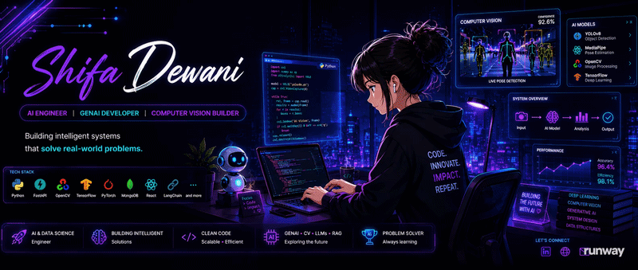

  

  

<h1 align="center">Hi, I'm Shifa 👋</h1>

<h3 align="center">
AI & Data Science Engineer • GenAI • Computer Vision
</h3>
## 🚀 About Me

- AI/ML Developer with 1+ year experience
- Building real-world AI and full-stack projects
- Interested in GenAI, Computer Vision, and automation

## 🚀 Currently Building

- AI-powered Employee Productivity Monitoring System  
- GenAI Resume Analyzer & ATS Matching Platform  
- Computer Vision based Automation Systems  
- Exploring RAG, LLM Agents, and AI Workflows
  
## 🛠 Tech Stack

Python | JavaScript | React | Node.js | MongoDB | FastAPI | SQL | Machine Learning | OpenCV | LangChain

## 🔥 Featured Projects

- SmartResume AI
- Curalink AI
- Employee Productivity Monitoring System
- Yoga AI App

## 🌐 Connect With Me

  
  
  

## 🛠 Tech Stack

  

  

  

  

